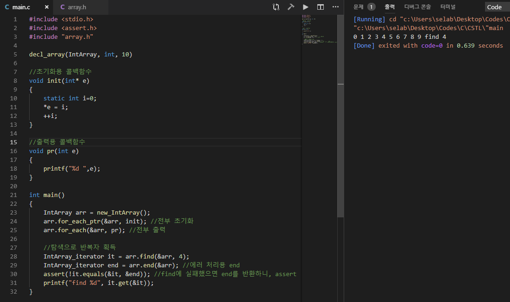

# C-STL  
  
## 소개
C의 매크로 함수를 응용하여 C++의 STL(Standard Template Library)을 흉내낸 라이브러리입니다.  
멤버-함수포인터를 사용하여 OOP의 형식을 가집니다.  
사용 조건은 C99입니다. C99의 몇몇 표준 라이브러리(stdbool.h 등)에 종속적입니다. 이 문제는 차후 해결할 예정입니다...
  
***  
  
## 라이센스
  
라이센스는 MIT 라이센스를 적용합니다.  
막 갖다쓰셔도 됩니다.  
  
***  
  
[레퍼런스용 위키로 이동](https://github.com/myyrakle/C-STL/wiki)  
  
***  
  
## 구현 현황  
  
매크로의 목록과 현황은 아래와 같습니다.  
- decl_array : 컴파일타임 정적 배열. 구현  
- decl_darray : 런타임 고정배열. 구현   
- decl_vector : 런타임 가변배열. 구현  
- decl_stack : 스택. 구현  
- decl_queue : 큐. 구현  
- decl_list : 양방향 연결리스트. 구현  
- decl_list : 단방향 연결리스트. 구현  
- decl_treeset : 트리셋. 구현중  
- decl_treemap : 트리맵. 미구현  
- decl_hashset : 해시셋. 미구현  
- decl_hashmap : 해시맵. 미구현  
- decl_maxheap : 최대 힙. 미구현  
- decl_minheap : 최소 힙. 미구현  
  
***  

## 사용례
  
C++의 std::array에 해당하는 매크로는 decl_array입니다.  
아래와 같이 선언하면 int 타입에 길이가 10인 배열 타입이 IntArray라는 이름으로 구체화됩니다.  
```
decl_array(IntArray, int, 10)
```
  
  
그리고 객체의 생성은 아래와 같이 합니다. 꼭 new를 사용해야 하는 건 아니지만, 추천하지 않습니다.  
```
IntArray arr = new_IntArray();
```
  
  
그리고 메서드를 사용할 때는 아래와 같이 합니다.  
꼭 자기 자신의 주소를 첫번째 인자로 전달해야 합니다.
```
arr.find(&arr, 100);
```
  
  
아래는 예시 이미지입니다.  

***  
  
## 기여자  
- [sean9892](https://github.com/sean9892)
